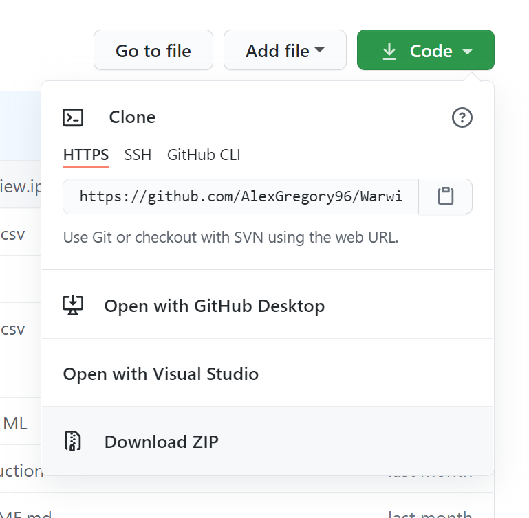
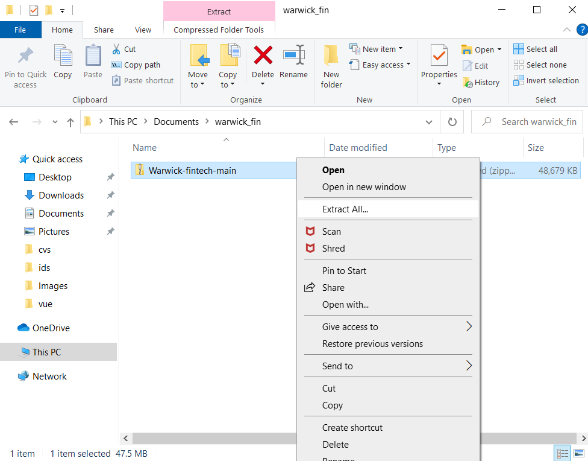
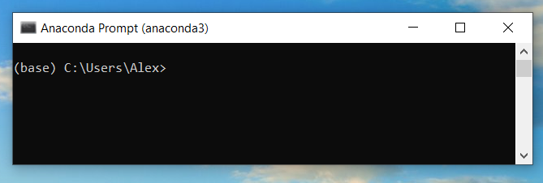
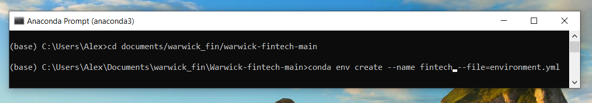
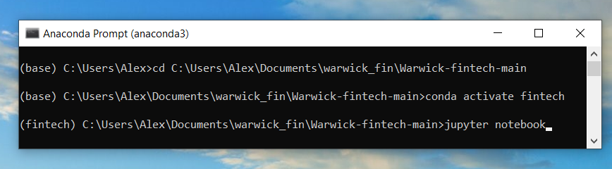

---

Welcome to the Warwick Bussiness School Financial Technology - Machine Learning Driven Quantitative Investment Github repository. This repository contains all of the Python code that we will be looking at throughout this module. The notebooks are designed to show you how we can use Python to preprocess and model financial data. The raw data that we will be using can be found in the [`Data`](Data) folder. 

## Contents 
  1. [loading_data.ipynb](https://github.com/danphilps/WBS_InfoSystems/blob/main/loading_data.ipynb) - For those of you that have downloaded the data in the data in the XLSX format, this notebook shows you how we can use Python to automatically convert the worksheets in the XLSX into seperate CSV which are much faster to work with in Python.
  2. [forecasting.ipynb](forecasting.ipynb) - In this notebook we look at some classic econometric techniques that can be used to forecast the data.
  3. [prepocessing.ipynb](prepocessing.ipynb) - Here we preprocess the data to prepare it for machine learning.
  4. [fitting_models.ipynb](fitting_models.ipynb) - In this notebook, we fit our first machine learning models to the data.
  5. [index.ipynb](index.ipynb) - Here we use the [Global MSCI Index](msci.com) to adjust our independent variable and look at some methods to explain our machine learning models.
  6. [pca.ipynb](pca.ipynb) - In this final notebook, we look at how we can convert categorical data into a numeric form to use in a machine learning. We will see that this can lead to high dimensional data leading to a discussion about dimensiaonality reduction techniques. 
  
## Downloading and running the code

The first step is to download the repository onto your computer. To do this click the green code button in top right of this page and click download as zip.

Once you have downloaded the zip folder put it into an appropriate place, right click the zip folder and click extract all. 

You should now have a folder called `WBS_InfoSystems-main` that contains all of the files and folders that you see in this repository. As mentioned before there are quite a lot of packages that have been used in this repository. To avoid any potential conflicts between packages you may have already installed we will install the packages needed for this repository in a new conda environment. Start by opening the anaconda command prompt. You should see a window similar to the one shown below.

Now navigate to the `WBS_InfoSystems-main` folder using the `cd` command.

 

Inside the `WBS_InfoSystems-main` folder, there is a file called `environment.yml` which contains the information needed to configure the conda environment. We can create a new environment based on `environment.yml` using the command `conda env create --name fintech --file=environment.yml` which creates an environment called fintech. Just a warning, installing all can take a while.

After we have create the fintech environment, we can activate it using `conda activate fintech` and open jupyter notebook by simply typing `jupyter notebook`.

Opening jupyter notebook from within the conda environment ensures that jupyter notebook is opened using the fintech environment. 

## Owner details

### Dan Philps, PhD, CFA
Dr Dan Philps is head of Rothko Investment Strategies and is an artificial intelligence (AI) researcher. He has over 20 years of quantitative investment experience. Prior to Rothko, he was a senior portfolio manager at Mondrian Investment Partners. Before 1998, Philps worked at a number of major investment banks, specializing in the design/development of trading and risk models.
He holds a PhD in AI and Computer Science from City, University of London, a BSc (Hons) from King’s College London, is a CFA charterholder, a member of CFA Society of the UK and is a member of the AAAI.
